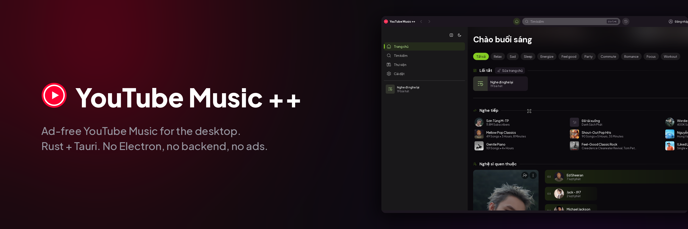
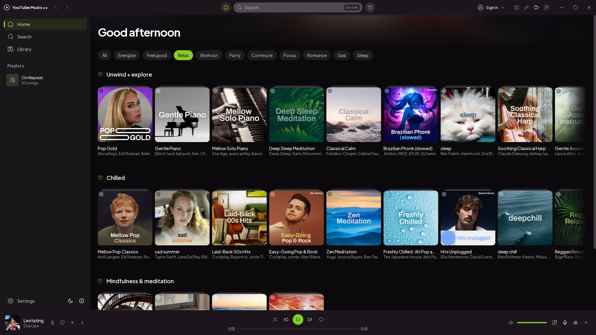
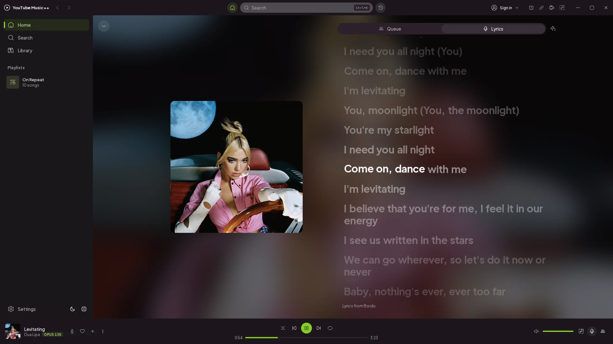
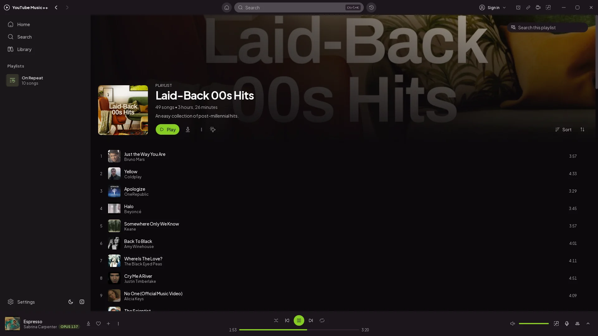
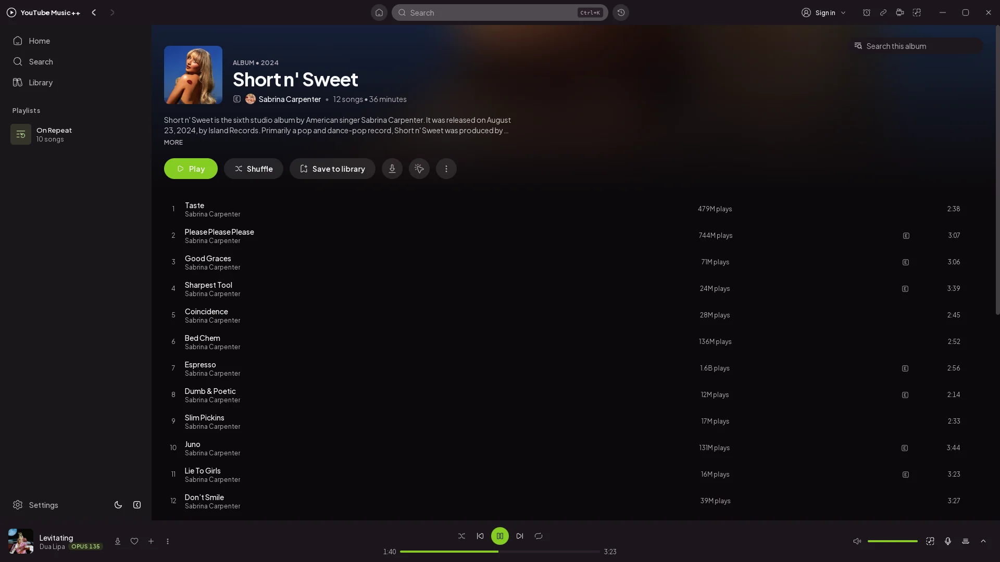
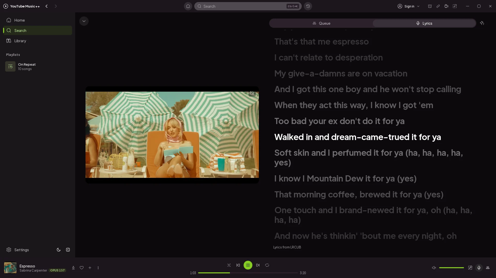
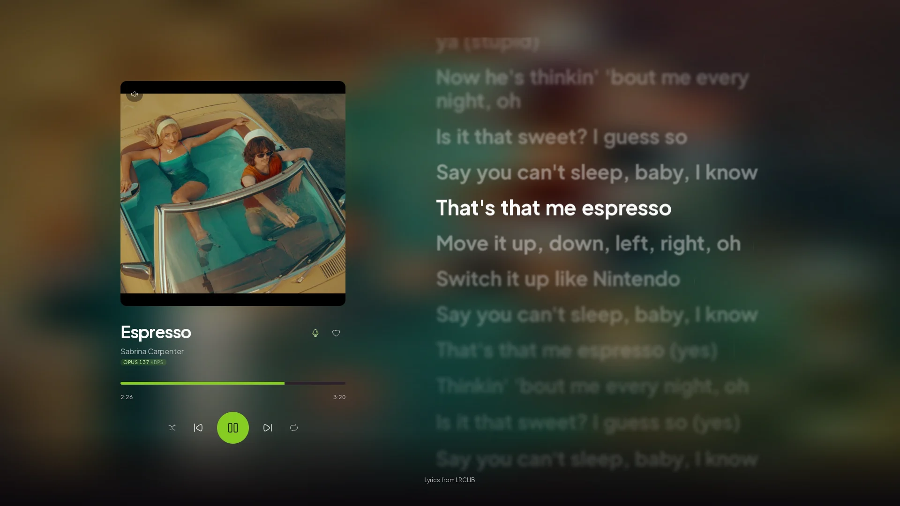

<div align="center">



# YouTube Music ++

**A native desktop YouTube Music client. Rust + Tauri, ad-free, no Electron.**

<p align="center">
  <a href="https://github.com/duykhanhxx03/limusic/releases/latest"></a>
  <a href="https://github.com/duykhanhxx03/limusic/releases/latest"></a>
  
  <a href="https://duykhanhxx03.github.io/limusic/"></a>
  <br>
  
  
  
  
  
</p>

**YouTube Music ++** talks directly to YouTube's internal API and plays audio through libmpv: no
bundled browser runtime, no backend server, no ads in the audio.

A fork of [Limusic](https://github.com/SimoHypers/limusic) by
[@SimoHypers](https://github.com/SimoHypers) — which itself started as a desktop rebuild of the
playback engine behind [Metrolist](https://github.com/mostafaalagamy/Metrolist), an Android
YouTube Music client. If this is useful to you, the original author takes coffees at
[ko-fi.com/simohypers](https://ko-fi.com/simohypers).

</div>

---

## Features

- **Ad-free playback**: streams come straight from YouTube's API, ads never do
- **Search & browse**: songs, albums, artists, playlists and the YTM home feed, with results previewing as you type
- **Sign in** with your YouTube Music account: in-app Google login or cookie-paste, several accounts at once with switching between them
- **Your library**: playlists, liked songs, saved albums and artists, your uploads, and write actions (like, add to playlist, create/edit/delete playlists including cover art, subscribe, save to library)
- **History**: everything you have played, in YouTube Music's own day buckets
- **Gapless playback** with loudness normalization, powered by libmpv
- **Queue** with radio/automix continuation, drag to reorder, restored across restarts
- **Synced lyrics, Apple Music style**: word by word where the source has the timings, with a soft sweep, depth of field and lines that glide into place, drawn on the GPU so they never shimmer. In the player view, in theater mode or in a side panel, with click-to-jump and translations under each line
- **Smooth track changes**: the next track's cover and lyrics are fetched while the current one plays, so a skip crossfades instead of loading
- **Music videos**: optional, the video plays where the artwork sits, with the same gapless audio behind it; video thumbnails use YouTube's HD renditions instead of the blurry default
- **Mini Player and theater mode**: shrink to a strip that keeps playing, or go fullscreen with cover and lyrics side by side
- **Local Music**: play your own files, with all metadata still intact
- **OS media keys** and now-playing integration (MPRIS on Linux, SMTC on Windows, plus playback buttons on the Windows taskbar preview)
- **System tray**: close the window, keep the music; play/pause and skip from the tray, optional start-on-login
- **Keyboard and mouse**: `Ctrl+K` searches from anywhere, `Ctrl+H` lists every shortcut, right-click menus throughout, `Ctrl` and the wheel zooms the interface
- **Sleep timer**: 15m, 30m, 1h, 3h or a custom count, kept in the Rust core so it still fires with the window hidden
- **Offline downloads**: save tracks to disk and play them with no connection, with progress and cancel
- **10-band equalizer** you draw on, with 22 presets, a preamp, and **AutoEq headphone corrections**: search about 8,800 measured headphones and apply the one you own. Applied in the audio chain rather than the UI
- **Audio quality badge**: the codec and real bitrate of the stream actually playing, not the nominal one
- **Eight languages**: English, Spanish, French, Indonesian, Brazilian Portuguese, Romanian, Turkish and Vietnamese
- **Self-updating builds** (AppImage on Linux, setup.exe on Windows, .app on macOS)
- **Make it yours**: accent palettes (Lime out of the box), custom colors, your own fonts, corner roundness, a custom app icon, and an adaptive theme that recolors the app from the playing cover
- **Clean surfaces**: next to no borders or divider lines; panels, menus and dialogs separate by tone, spacing and a soft shadow

---

## Screenshots

<table>
  <tr>
    <td></td>
    <td></td>
  </tr>
  <tr>
    <td></td>
    <td></td>
  </tr>
  <tr>
    <td></td>
    <td></td>
  </tr>
</table>

---

<h2 align="center">Download & Install</h2>

<p align="center">
  <a href="https://github.com/duykhanhxx03/limusic/releases/latest">
    
  </a>
</p>

| Platform | File | Notes |
|---|---|---|
| Linux | `.AppImage` | Self-updating, libmpv bundled. Needs glibc 2.39+ (Ubuntu 24.04+, Debian 13+, Fedora 40+) |
| Linux (Ubuntu/Debian) | `.deb` | No self-update. Needs Ubuntu 24.04+ / Debian 13+; apt pulls libmpv and webkit2gtk in for you |
| Linux (Fedora/RHEL) | `.rpm` | Needs `mpv-libs` installed (`sudo dnf install mpv-libs`). Updates through dnf, not in-app |
| Windows | `-setup.exe` | Self-updating |
| Windows | `.msi` | Plain installer, no auto-update |
| macOS (Apple Silicon) | `.dmg` | Self-updating. Unsigned, so the first launch needs `xattr -dr com.apple.quarantine /Applications/limusic.app` |
| macOS (Intel) | none | Build from source, see [docs/BUILD-PLATFORMS.md](docs/BUILD-PLATFORMS.md) |

> **Linux with an NVIDIA GPU:** WebKitGTK switches its GPU renderer off by itself on NVIDIA's
> proprietary driver, which left every animation drawn on the CPU. The app turns it back on at
> startup, on Wayland and X11 alike, and nothing needs configuring. To A/B it, set any of
> `WEBKIT_DISABLE_DMABUF_RENDERER`, `WEBKIT_FORCE_DMABUF_RENDERER` or
> `WEBKIT_DMABUF_RENDERER_FORCE_SHM` yourself and the app leaves the choice to you.

---

## Lyrics

Open them with the microphone button in the player bar. By default they are a
tab in the player view, beside the queue, and the button beside it enlarges them
to the whole view; turn off **Settings -> Appearance -> Queue and lyrics in the
player view** to get a side panel instead. Theater mode shows them next to the
cover, larger.

Word-synced lyrics are drawn with WebGL ([PixiJS](https://pixijs.com)) rather
than as page text. WebKitGTK repaints text on the pixel grid on every frame of a
sub-pixel move, so a line gliding up, a word lifting as it is sung or a line
growing into focus all visibly trembled; here each word is drawn once into a
texture and moved by the GPU, like Apple Music's own layers. The mini player,
and any machine without a usable GPU, keep the plain-text renderer.

Lyrics come from [Boidu](https://boidu.dev) first, then
[LRCLIB](https://lrclib.net), then YouTube Music's own timed lyrics, then
Netease, QQ Music and Kugou, falling back to plain un-timed text when nobody has
a synced version. Matching is keyed on the track's exact length, because popular
songs exist as several cuts and the wrong one drifts a few seconds out. Results
are cached locally, so replaying a track is instant.

Boidu is the only source with per-word timings, which is what lets a line
highlight word by word as it's sung. It goes first for that reason, which also
means it is asked about every track you play. Turn it off in **Settings ->
Playback -> Synchronized lyrics (Boidu/LRCLIB)** and the other sources still provide
line-by-line lyrics. Netease additionally supplies translations, shown under
each line where it has them.

Note that YouTube Music's lyrics are licensed per region and are missing
entirely in some countries. Where that's the case, LRCLIB does all the work.

---

## Translations

English, Spanish, French, Indonesian, Brazilian Portuguese, Romanian, Turkish
and Vietnamese ship in the app today. Italian, Russian and Ukrainian catalogs
are in the tree but not yet wired into the picker.

Catalogs are plain JSON under `ui/src/lib/locales/`. `en.json` is the source of
truth and the only complete one — `t()` falls back to it per key, so a partial
catalog renders English for whatever it is missing rather than a raw key. That
makes incomplete translations safe to submit.

Switching a finished language on in the picker takes a small code change too,
see [CONTRIBUTING.md](CONTRIBUTING.md#translations).

> Upstream translates on [Weblate](https://hosted.weblate.org/engage/limusic/).
> This fork does not, so edit the JSON here directly.

---

## Building from Source

You need Rust (stable), Node with pnpm, and the Tauri CLI
(`cargo install tauri-cli --version "^2"`).

Ubuntu / Debian:

```bash
sudo apt install libmpv-dev libwebkit2gtk-4.1-dev libgtk-3-dev librsvg2-dev \
  libssl-dev libdbus-1-dev libayatana-appindicator3-dev
cd ui && pnpm install && cd ..
cargo tauri build --bundles deb
```

Fedora:

```bash
sudo dnf install mpv-libs mpv-libs-devel webkit2gtk4.1-devel \
  gcc gcc-c++ make openssl-devel librsvg2-devel
cd ui && pnpm install && cd ..
cargo tauri build
```

For development, `cargo tauri dev` runs the app against the Vite dev server with hot reload.
Windows and macOS instructions live in [docs/BUILD-PLATFORMS.md](docs/BUILD-PLATFORMS.md).

---

## How It Works, Briefly

- A pure Rust crate speaks YouTube's InnerTube API, impersonating several
  official client identities and falling back between them when one fails.
- YouTube's stream URLs are protected by obfuscated JavaScript (the signature
  cipher and the `n` parameter) and by BotGuard attestation. The app runs that
  JavaScript where it expects to run, in a real webview, hidden, and never lets
  any of it touch the UI process.
- Audio goes through libmpv: gapless transitions, an on-disk cache, and
  loudness normalization from YouTube's own metadata.
- The UI is a SvelteKit SPA that only ever talks to the Rust core. It never
  contacts YouTube itself.
- Lyrics keep time with a small clock that smooths mpv's position reports
  (they arrive late, never early), and the word-synced view is a WebGL stage
  driven by that clock rather than by the DOM.

---

## Disclaimer

This project is not affiliated with, funded, authorized, endorsed by, or in
any way associated with YouTube, Google LLC, or any of their affiliates and
subsidiaries. "YouTube" and "YouTube Music" are trademarks of Google LLC; the
name of this fork describes what it plays and claims no connection to them.

All trademarks, service marks, and intellectual property rights referenced in
this project belong to their respective owners.

---

## License

[GPL-3.0](LICENSE)
